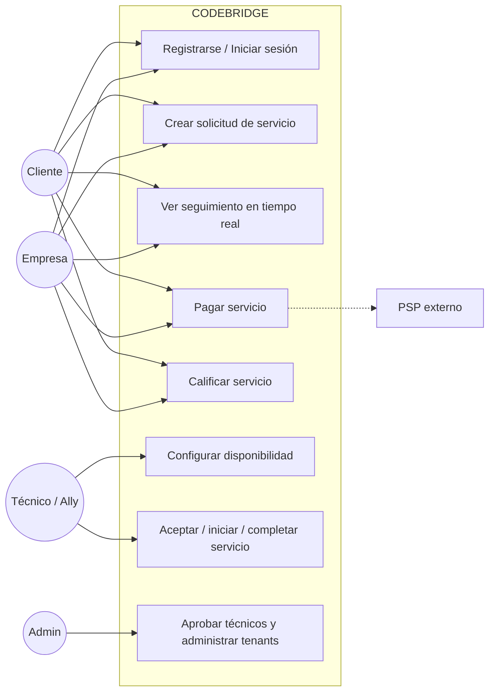
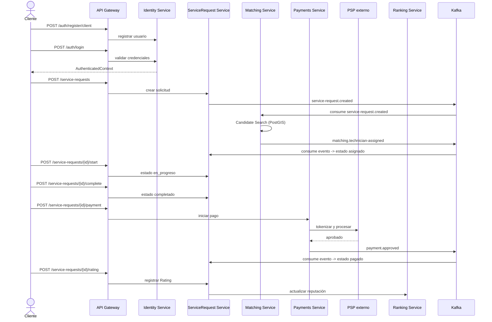

# 8. Vista de Escenarios (+1)

---

## 8.1 Diagrama de casos de uso

---

## 8.2 Escenarios principales

Para cada escenario se documenta: actor, precondiciones, flujo principal, flujos alternos, servicios participantes, datos involucrados, eventos/endpoints, relación con las demás vistas y requisitos asociados (SRS v3.0, CODEBRIDGE).

### Escenario 1 — Cliente registra una cuenta y crea una solicitud

| | |
|---|---|
| **Actor** | Cliente (variante: Empresa) |
| **Precondiciones** | El usuario no tiene cuenta. El Catalog Service tiene categorías vigentes. |
| **Flujo principal** | 1. `POST /v1/auth/register/client` (Identity Service) crea `User` y, si aplica, `Tenant`. 2. `POST /v1/auth/login`, se obtiene `AuthenticatedContext` (userId, tenantId, rol). 3. El cliente consulta `ServiceCategory` disponibles (Catalog Service). 4. `POST /v1/service-requests` (ServiceRequest Service): se crea el agregado en estado `buscando_tecnico`. 5. Se produce el evento `service-request.created`. |
| **Flujos alternos** | Correo ya registrado → rechazo (RF-01). Token expirado en login → reintento de autenticación. |
| **Servicios participantes** | API Gateway, Identity Service, Catalog Service, ServiceRequest Service, Kafka. |
| **Datos involucrados** | `users`, `tenants`, `service_categories`, `service_requests`. |
| **Eventos / Endpoints** | `POST /v1/auth/register/client`, `POST /v1/auth/login`, `POST /v1/service-requests` · produce `service-request.created`. |
| **Relación con Vista Lógica** | Identity Service + Catalog Service + ServiceRequest Service (Sección 3.2). |
| **Relación con Vista de Procesos** | *Pendiente Backend+QA* — validar si el registro y la creación de solicitud son síncronos de extremo a extremo o si la publicación del evento introduce un punto asíncrono. |
| **Relación con Vista de Desarrollo** | *Pendiente Backend+Frontend* — formulario de registro/solicitud (Next.js / Flutter) contra los contratos REST anteriores. |
| **Relación con Vista Física** | *Pendiente DevOps* — ruta API Gateway → Identity/Catalog/ServiceRequest dentro del clúster k3s. |
| **Requisitos (SRS)** | RF-01, RF-03, RF-04, RF-06, RF-07, RF-08 |

### Escenario 2 — El sistema encuentra y asigna un técnico

| | |
|---|---|
| **Actor** | Sistema (Matching Service), Técnico/Ally |
| **Precondiciones** | Evento `service-request.created` publicado. Existen `TechnicianAvailability` y `CoverageZone` compatibles con la solicitud. |
| **Flujo principal** | 1. Matching Service consume `service-request.created`. 2. Valida el contexto de la solicitud. 3. Busca técnicos disponibles (`TechnicianAvailability`). 4. Filtra por cobertura geográfica (`CoverageZone`, PostGIS). 5. Ordena candidatos por criterios de matching. 6. Registra el intento de asignación (`MatchingAttempt`). 7. Si se encontró un técnico elegible, produce `matching.technician-assigned`. 8. ServiceRequest Service consume el evento y transiciona a `asignado`. 9. Communication Service notifica al técnico. |
| **Flujos alternos** | Ningún candidato elegible tras el filtrado/ordenamiento → Escenario 3. |
| **Servicios participantes** | Matching Service, ServiceRequest Service, Communication Service, Kafka. |
| **Datos involucrados** | `technician_availability`, `coverage_zones`, `matching_attempts`, `service_requests`. |
| **Eventos / Endpoints** | Consume `service-request.created` · produce `matching.technician-assigned`. |
| **Relación con Vista Lógica** | Matching Service (Sección 3.2.6), Figura 3 (flujo lógico del matching). |
| **Relación con Vista de Procesos** | *Pendiente Backend+QA* — concurrencia entre múltiples `MatchingAttempt` simultáneos, consumer group del Matching Service. |
| **Relación con Vista de Desarrollo** | *Pendiente* — módulo Java/Spring Boot del Matching Service. |
| **Relación con Vista Física** | *Pendiente DevOps* — nodo/contenedor del Matching Service y latencia hacia PostgreSQL+PostGIS. |
| **Requisitos (SRS)** | RF-09, RF-10 · RNF-05 (asignación en menos de 60s) |

### Escenario 3 — No existe técnico disponible y la solicitud queda en espera

| | |
|---|---|
| **Actor** | Sistema (Matching Service) |
| **Precondiciones** | Candidate Search no retorna candidatos válidos. |
| **Flujo principal** | 1. Matching Service no encuentra técnico compatible. 2. Produce `matching.no-technician-available`. 3. ServiceRequest Service consume el evento y transiciona a `en_espera`. |
| **Flujos alternos** | Reintento posterior cuando cambia la disponibilidad de algún técnico (fuera de alcance del MVP si no está implementado como *retry* automático). |
| **Servicios participantes** | Matching Service, ServiceRequest Service. |
| **Datos involucrados** | `matching_attempts`, `service_requests`. |
| **Eventos / Endpoints** | Produce `matching.no-technician-available`. |
| **Relación con Vista Lógica** | Matching Service, estado `en_espera` de `ServiceRequestStatus`. |
| **Relación con las demás vistas** | *Pendiente* de integración por los responsables respectivos. |
| **Requisitos (SRS)** | RF-09 (manejo explícito de "En espera" cuando no hay técnico disponible) |

### Escenario 4 — El técnico inicia y completa el servicio

| | |
|---|---|
| **Actor** | Técnico/Ally, Cliente / Empresa (observador del estado) |
| **Precondiciones** | Solicitud en estado `asignado`. |
| **Flujo principal** | 1. El técnico consulta `GET /v1/service-requests/{id}`. 2. `POST /v1/service-requests/{id}/start` → transición a `en_progreso`. 3. El cliente o la empresa que originó la solicitud observa el cambio de estado en tiempo real (vía Communication Service / canal de notificaciones). 4. `POST /v1/service-requests/{id}/complete` → transición a `completado`. 5. Se produce `service-request.completed`. |
| **Flujos alternos** | Intento de completar sin haber iniciado → rechazo por `State Validation`. |
| **Servicios participantes** | ServiceRequest Service, Communication Service. |
| **Datos involucrados** | `service_requests`. |
| **Eventos / Endpoints** | `POST /v1/service-requests/{id}/start`, `POST /v1/service-requests/{id}/complete` · produce `service-request.completed`. |
| **Relación con Vista Lógica** | ServiceRequest Service — módulo *Service Lifecycle* y *State Validation* (Sección 3.2.5). |
| **Relación con Vista de Procesos** | *Pendiente* — propagación del cambio de estado hacia el cliente (¿polling, WebSocket, push?). |
| **Requisitos (SRS)** | RF-11, RF-13, RF-14, RF-15 · RNF-06 (reflejo de estado en menos de 1 minuto) |

### Escenario 5 — El cliente realiza el pago

| | |
|---|---|
| **Actor** | Cliente / Empresa |
| **Precondiciones** | Solicitud en estado `completado`. |
| **Flujo principal** | 1. `POST /v1/service-requests/{id}/payment` (Payments Service). 2. *PSP Adapter* tokeniza la operación con el proveedor de pagos externo (PSP). 3. Se crea `Payment` con `PaymentTokenReference`, sin almacenar PAN/CVV. |
| **Flujos alternos** | Ver Escenario 6 (aprobación/rechazo del PSP). |
| **Servicios participantes** | Payments Service (PSP Adapter), ServiceRequest Service. |
| **Datos involucrados** | `payments`. |
| **Eventos / Endpoints** | `POST /v1/service-requests/{id}/payment`. |
| **Relación con Vista Lógica** | Payments Service — módulos *Payment Processing* y *PSP Adapter* (Sección 3.2.8). |
| **Relación con Vista Física** | *Pendiente DevOps* — salida de red autorizada hacia el PSP externo, reglas de seguridad. |
| **Requisitos (SRS)** | RF-22, RF-23 · RNF-01 (PCI-DSS, no se persiste PAN/CVV) · RIE-01 |

### Escenario 6 — El PSP aprueba o rechaza el pago

| | |
|---|---|
| **Actor** | Sistema (Payments Service), PSP externo |
| **Precondiciones** | Pago iniciado (Escenario 5). |
| **Flujo principal** | 1. El PSP responde de forma asíncrona. 2. Payments Service produce `payment.approved` o `payment.rejected`. 3. ServiceRequest Service consume el evento: si es `approved`, transiciona a `pagado`; si es `rejected`, permanece en `completado` y permite reintento. 4. Si fue aprobado, Billing genera `Invoice`. |
| **Flujos alternos** | Pago rechazado → el cliente puede reintentar (vuelve al Escenario 5). |
| **Servicios participantes** | Payments Service, ServiceRequest Service. |
| **Datos involucrados** | `payments`, `invoices`. |
| **Eventos / Endpoints** | Produce `payment.approved` / `payment.rejected` · `GET /v1/payments/{id}/invoice`. |
| **Relación con Vista Lógica** | Payments Service — módulo *Billing / Invoice Management*. |
| **Relación con Vista de Procesos** | *Pendiente* — este es el escenario más sensible a fallas de Kafka; ver también Escenario 9. |
| **Requisitos (SRS)** | RF-24 |

### Escenario 7 — El cliente califica el servicio

| | |
|---|---|
| **Actor** | Cliente / Empresa |
| **Precondiciones** | Solicitud en estado `pagado`. |
| **Flujo principal** | 1. `POST /v1/service-requests/{id}/rating` (ServiceRequest Service) crea `Rating`, asociado al usuario o cuenta corporativa que originó la solicitud. 2. Ranking Service consume el resultado y recalcula la reputación del técnico. |
| **Flujos alternos** | Intento de calificar sin pago confirmado → rechazo. |
| **Servicios participantes** | ServiceRequest Service, Ranking Service. |
| **Datos involucrados** | `ratings`. |
| **Eventos / Endpoints** | `POST /v1/service-requests/{id}/rating`. |
| **Relación con Vista Lógica** | ServiceRequest Service (módulo *Ratings*) + Ranking Service (Sección 3.2.7). |
| **Requisitos (SRS)** | RF-12 |

### Escenario 8 — Una empresa/tenant consulta información sin acceder a datos de otro tenant

| | |
|---|---|
| **Actor** | Empresa, Admin |
| **Precondiciones** | Usuario autenticado con `AuthenticatedContext` (incluye `tenantId`). |
| **Flujo principal** | 1. El usuario consulta sus solicitudes/dashboard. 2. Cada servicio filtra automáticamente por `tenant_id` derivado del contexto autenticado. 3. Un intento de acceder a datos de otro `tenant_id` es rechazado. |
| **Flujos alternos** | Intento de acceso no autorizado → error 403, registrado en log (RNF-04). |
| **Servicios participantes** | API Gateway (propagación de identidad/tenant), todos los microservicios (aislamiento en sus propias consultas). |
| **Datos involucrados** | Todas las tablas con columna `tenant_id`. |
| **Relación con Vista Lógica** | Regla transversal de *Multi-tenancy* (Sección 3.1.3 y 4.2). PostgreSQL RLS como defensa adicional. |
| **Requisitos (SRS)** | RF-04, RF-05, RF-18, RF-21 · RNF-04, RNF-09, RNF-10 |

### Escenario 9 — Kafka presenta una falla temporal y el evento se recupera mediante Outbox

| | |
|---|---|
| **Actor** | Sistema (cualquier servicio productor) |
| **Precondiciones** | Un servicio necesita publicar un evento (ej. `service-request.created`, `payment.approved`) y Kafka no está disponible. |
| **Flujo principal** | 1. El servicio registra localmente el cambio de estado y el evento pendiente (Transactional Outbox). 2. El publicador reintenta con backoff hasta que Kafka esté disponible. 3. El evento se publica y los consumidores lo procesan de forma idempotente usando `eventId`. |
| **Flujos alternos** | Reintentos agotados → DLQ (a definir en Vista de Procesos). |
| **Servicios participantes** | Cualquier servicio productor, Kafka. |
| **Relación con Vista Lógica** | Regla transversal *Idempotencia* y *Transactional Outbox* (Sección 4.2). |
| **Relación con Vista de Procesos** | *Pendiente Backend+QA* — política de backoff, número de reintentos, definición de DLQ. |
| **Requisitos (SRS)** | RNF-07, RNF-08 (disponibilidad; un fallo no debe bloquear el flujo de negocio de forma permanente) |

---

## 8.3 Diagrama de secuencia — Escenario crítico de extremo a extremo

Cubre el flujo Escenarios 1 → 2 → 4 → 5 → 6 → 7 (registro → matching → ejecución → pago → calificación), que corresponde a la prueba end-to-end de RF-27.

> En este diagrama, el actor `Cliente` representa indistintamente a un **Cliente** o a una **Empresa**, ya que ambos siguen el mismo flujo de seguimiento, pago y calificación sobre sus propias solicitudes.

---

## 8.4 Matriz Escenario → Componentes → Vistas

| # | Escenario | Componentes principales | Vista Lógica | Vista de Procesos | Vista de Desarrollo | Vista Física |
|---|---|---|---|---|---|---|
| 1 | Registro y creación de solicitud | Identity, Catalog, ServiceRequest | ✅ Validado | ⏳ Pendiente | ⏳ Pendiente | ⏳ Pendiente |
| 2 | Matching y asignación | Matching, ServiceRequest, Communication | ✅ Validado | ⏳ Pendiente | ⏳ Pendiente | ⏳ Pendiente |
| 3 | Sin técnico disponible | Matching, ServiceRequest | ✅ Validado | ⏳ Pendiente | ⏳ Pendiente | ⏳ Pendiente |
| 4 | Ejecución del servicio | ServiceRequest, Communication | ✅ Validado | ⏳ Pendiente | ⏳ Pendiente | ⏳ Pendiente |
| 5 | Pago | Payments, ServiceRequest | ✅ Validado | ⏳ Pendiente | ⏳ Pendiente | ⏳ Pendiente |
| 6 | Aprobación/rechazo PSP | Payments, ServiceRequest | ✅ Validado | ⏳ Pendiente | ⏳ Pendiente | ⏳ Pendiente |
| 7 | Calificación | ServiceRequest, Ranking | ✅ Validado | ⏳ Pendiente | ⏳ Pendiente | ⏳ Pendiente |
| 8 | Aislamiento multi-tenant | API Gateway, todos los servicios | ✅ Validado | ⏳ Pendiente | ⏳ Pendiente | ⏳ Pendiente |
| 9 | Falla temporal de Kafka | Cualquier productor, Kafka | ✅ Validado | ⏳ Pendiente | ⏳ Pendiente | ⏳ Pendiente |

**Criterio de validación del Product Owner:** un escenario queda completamente validado cuando las cuatro vistas técnicas lo resuelven de forma coherente. Actualmente los 9 escenarios están cubiertos por la Vista Lógica; falta la confirmación de Backend+QA (Procesos), Backend+Frontend (Desarrollo) y DevOps (Física) para cerrar la integración cruzada indicada en la Sección 9 del SDD.

---

## 8.5 Requisitos no cubiertos explícitamente por ningún escenario

Como parte de la validación de completitud, reviso qué RF/RNF del SRS v3.0 **no** quedan representados en los 9 escenarios anteriores, para que el equipo decida si se documentan aparte o se consideran fuera del alcance de esta vista:

- **RF-16, RF-17** (gestión de equipo del Proveedor/Ally, historial del técnico) — no tienen escenario propio; se recomienda agregarlos si el Actors Service define su persistencia en un sprint próximo.
- **RF-19, RF-20** (aprobación/suspensión de técnicos por Admin) — mencionados tangencialmente en el Escenario 8, pero no tienen flujo propio.
- **RF-26 a RF-29** (CI/CD, pruebas, logging, cifrado) — corresponden a la Vista Física/Procesos, no a escenarios de negocio; se consideran cubiertos por esas vistas cuando DevOps las entregue.
